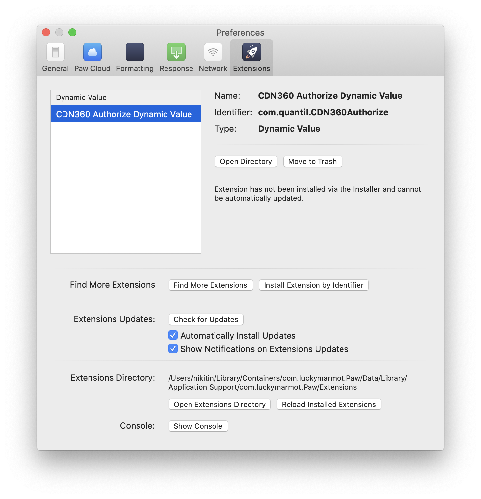
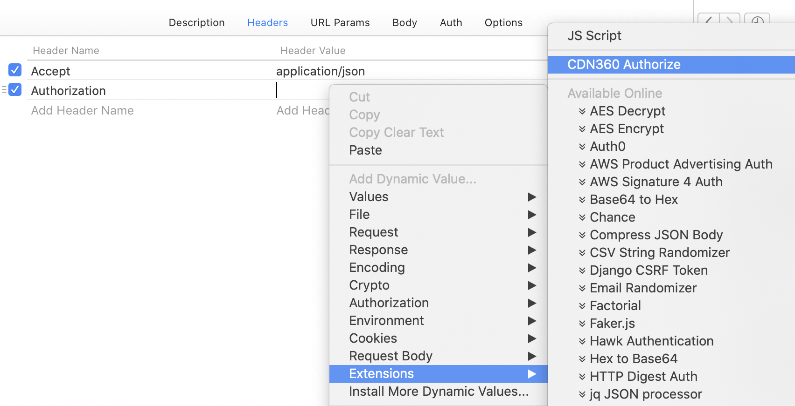
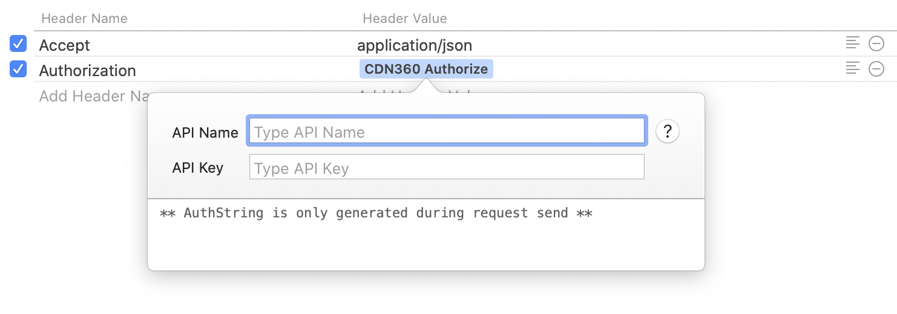
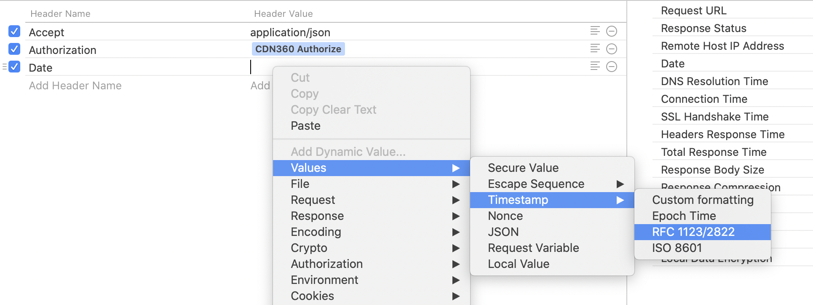
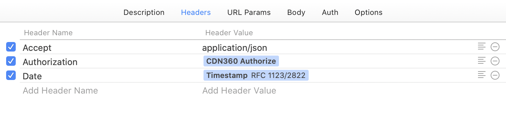

## Paw CDN360 Authorize Dynamic Value

This is the [PAW](https://paw.cloud/) extension, which automatically generates Authorization header based on provided API Name, API Key and the current Timestamp.


### Installation

Before installing, make sure [PAW](https://paw.cloud/) is is installed

```bash
# Install dependencies
yarn

# Build extension
yarn build

# Install Extension
make install
```

After that run [PAW](https://paw.cloud/) and check that extension is present.



Then we should set request header parameters. For `Authorization` header we will select a `CDN360 Authorize` extension.



After that popup with two input fields `apiName`, `apiKey` will appear. Those values needed to be filled.



Finally, we should add the `Date` field to our request header, and choose `Timestamp -> RFC1123` value.



And we done! 

